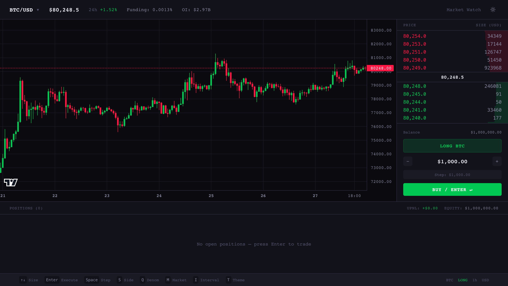
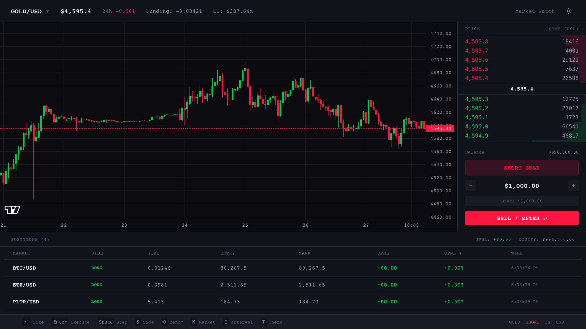
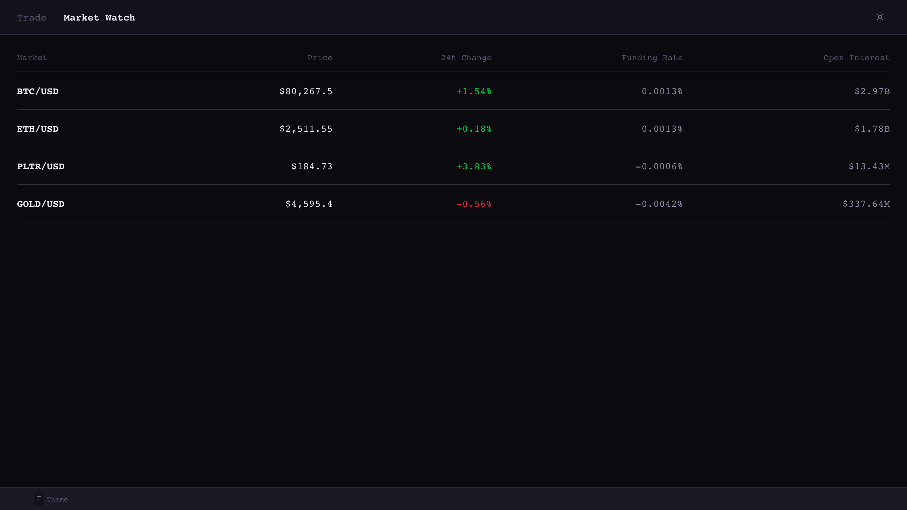
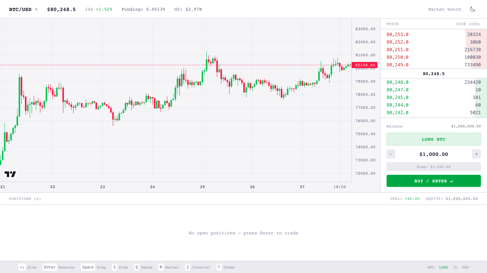
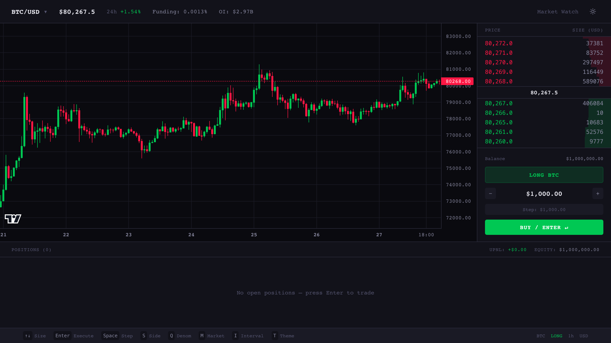

# Hyperkeys

A keyboard-native perpetual futures trading interface built on the Hyperliquid API. Live market data, a depth-weighted orderbook, candlestick charting, and simulated order execution — all driven primarily from the keyboard.



## Quick start

```bash
npm install
npm run dev
```

Open [localhost:3000](http://localhost:3000). No API keys or accounts are needed — Hyperliquid's market data endpoints are public, and order execution is simulated locally against a $1M paper balance.

```bash
npm run build   # production build
npm run lint    # eslint
```

## Keyboard shortcuts

| Key | Action |
|-----|--------|
| `↑` / `↓` | Increase / decrease order size |
| `Enter` | Execute order |
| `Space` | Cycle size increment ($100 → $500 → … → $100k) |
| `S` | Toggle long / short |
| `Q` | Toggle denomination (USD / base units) |
| `M` | Cycle market |
| `I` | Cycle candle interval |
| `T` | Toggle theme |

Keystrokes aimed at text fields or at the browser (`⌘T`, `Ctrl+R`, …) are ignored.

## Screens

### Trading

The main view: market header, chart, orderbook, order entry, and open positions.



Positions carry unrealized PnL against live mid prices, in dollars and percent of cost basis.

### Market watch

A sortable-at-a-glance overview of every supported market, on the same live feeds. Cells flash green or red as values move.



### Themes and mobile

Dark and light themes, chosen by time of day on first paint and toggleable with `T`. The layout collapses to a single column with a compact control strip on small screens.

<p>
  
  
</p>

## Markets

Four markets across two Hyperliquid dexes:

- **BTC/USD**, **ETH/USD** — default perp dex
- **PLTR/USD**, **GOLD/USD** — `xyz` builder dex

Assets on the builder dex are namespaced (`xyz:GOLD`) in every API response, so they need their own `allMids` and `metaAndAssetCtxs` queries and their own websocket subscription. Coin ids address the API; the bare symbol is used for display.

## Architecture

```
src/
  app/          routes: / (trading), /market-watch
  components/   presentational + container components
  hooks/        data hooks (react-query + websocket) and DOM hooks
  lib/          api client, websocket client, formatting, constants
  stores/       zustand trading store
  types/        API and domain types
```

**Stack** — Next.js 16 (App Router) and React 19, Zustand for trading state, TanStack Query for data, Tailwind CSS 4, and TradingView's Lightweight Charts.

### Data flow

Every market feed follows the same shape: React Query holds a REST snapshot, and a websocket subscription patches that cache entry as updates arrive.

```
REST snapshot ──► React Query cache ──► components
                        ▲
websocket push ─────────┘  (queryClient.setQueryData)
```

Snapshots use `staleTime: Infinity`, since the socket — not polling — is what keeps them current. Only funding, open interest, and 24h reference prices refetch on an interval, because they aren't streamed.

The websocket client (`lib/ws.ts`) is a singleton with one connection for the whole app: subscriptions are de-duplicated by key, dropped when their last handler unmounts, replayed after a reconnect, and reconnected with exponential backoff. Channels are declared as `{ key, payload }` descriptors so the local routing key and the wire format stay in one place.

### Order execution

Orders fill instantly at the current mid price against a simulated balance:

- **Open** a new position
- **Increase** a same-side position, blending into a weighted average entry
- **Reduce** a position, realizing PnL on the closed portion
- **Flip** when an opposite-side order exceeds the current size

Execution reads prices from a ref rather than component state, so the order path always sees the latest tick without re-rendering on every price update.

## License

[MIT](LICENSE)
